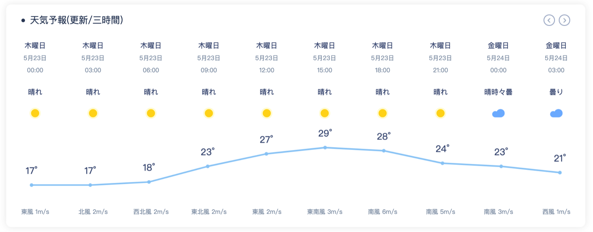
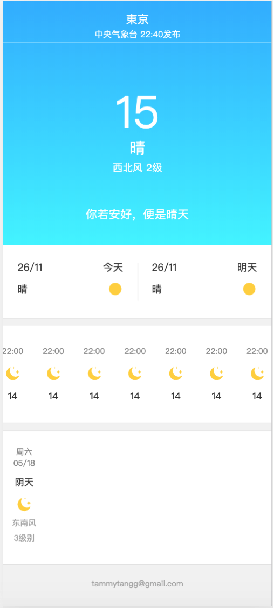

# 天気予報のウェブページ
簡単な天気予報アプリです。

## 1. Demoを見る方法
node.jsの環境が必要です。
ソースコードをダウンロード後、distフォルダー以下のファイルをapacheなどのサーバにおきます。
（ node app.jsで起動して、デモも見えます。)

## 2. フォルダー構成
```
weather
│   README.md
│   package.json
│   postcss.config.js
│   webpack.config.js
│   app.js //簡易サーバ
│ 
└───dist //build後のファイル
│   
│ 
└───src //ソースコード
```

## 3. 画面設計
### 3.1 PC版
三つの部分に分けています。
- Header

東京をクリックすると、メニューから場所を選べます。

- 現在の天気
温度、天気、天気のアイコン、風向(アイコンの方向も変更)、湿度、気圧などの情報があります。

- 天気予報
右上のボタンでページを変更できます。

### 3.2 スマホ版
まだネットに繋がってないですが、staticな画面を設計しました。


## 4. 利用した技術
- React
- Redux
- Webpack
- ES6
- HTML
- CSS(Styled-Component)

## 5. 工夫した点
- echartsを利用して、温度の傾向を表ます。
- スマホ用の画面も設計しました。
- 天気、風向によって、画像も変更する。


